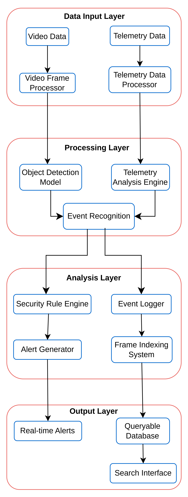

Still working on the project...

### To run the project:
1. Clone the repository

```bash
git clone https://github.com/KumaarBalbir/droneAnalyzer.git
```

2. Create a virtual environment in the root directory of the project
On Ubuntu or Debian based systems:
```bash
python3 -m venv <venv_name>
```
On Windows:
```bash
python -m venv <venv_name>
```
3. Activate your virtual environment:
On Ubuntu or Debian based systems:
```bash
source <venv_name>/bin/activate
```
On Windows:
```bash
<venv_name>\Scripts\activate
```

3. Install uv (a fast Python package manager that acts as a drop-in replacement for pip)
```bash
pip install uv
```
4. Install the project dependencies

```bash
uv pip install -r pyproject.toml
```

3. Run the project
```bash 
streamlit run main.py --server.port 5000
```

4. View the project in your browser
```bash
http://localhost:5000
```

5. The project architecture:




### Design Decisions & Architecture

#### Core Architecture

1. **Modular Design**
   - Separated concerns into distinct modules (processors, models, storage, alerts)
   - Each module has a single responsibility
   - Easy to extend and maintain

2. **Data Flow Pipeline**
   ```
   Video Input → Frame Processing → Object Detection → Event Analysis → Storage/Alerts
   ```
   - Linear pipeline for predictable data flow
   - Each stage processes data independently
   - Easy to add new processing stages

3. **Vision Language Model Choice (BLIP)**
   - Selected over CLIP for better scene understanding
   - Provides detailed natural language descriptions
   - More suitable for security surveillance use case
   - Better at describing activities and relationships

4. **Storage Design (will shift from in Memory to persistent storage)**
   - Frame-by-frame indexing for historical analysis
   - Separate event logging for security incidents
   - Enables efficient querying by time and object type
   - Supports both real-time and historical analysis

#### Technical Choices

1. **Video Processing**
   - OpenCV for efficient frame capture and processing
   - Configurable frame sampling rate (1 FPS default)
   - Support for both live streams and recorded videos
   - Memory-efficient processing

2. **Object Detection**
   - YOLOv8 for real-time object detection
   - Configurable confidence thresholds
   - Supports multiple object classes
   - Efficient inference on CPU/GPU

3. **Data Structures**
   - Standardized frame data format
   - Consistent event logging structure
   - Type hints for better code maintainability
   - JSON-compatible data structures

4. **API Design**
   - Simple, intuitive interfaces
   - Consistent method naming
   - Clear input/output contracts
   - Easy to integrate with other systems

#### Performance Considerations

1. **Scalability**
   - Modular design allows horizontal scaling
   - Efficient indexing for quick queries


#### Security Features

1. **Alert System**
   - Configurable security rules
   - Multiple alert severity levels
   - Real-time alert generation
   - Historical alert tracking

#### Future Extensibility

1. **Planned Enhancements**
   - Additional ML model support
   - Enhanced query capabilities
   - Advanced analytics features
   - Integration with external systems

2. **Integration Points**
   - Shift to persistent frame indexing
   - Standard API endpoints
   - Webhook support
   - Database adapters
   - Message queue integration
